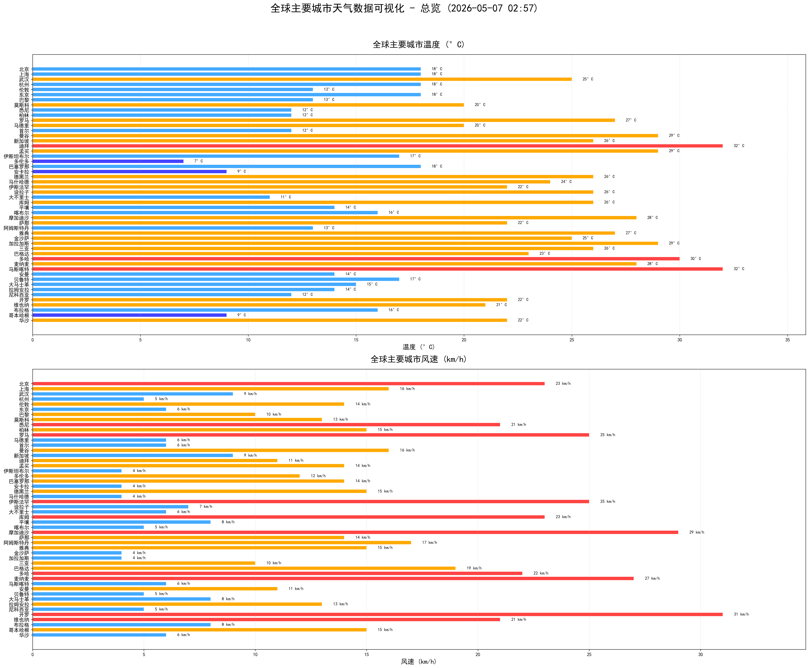
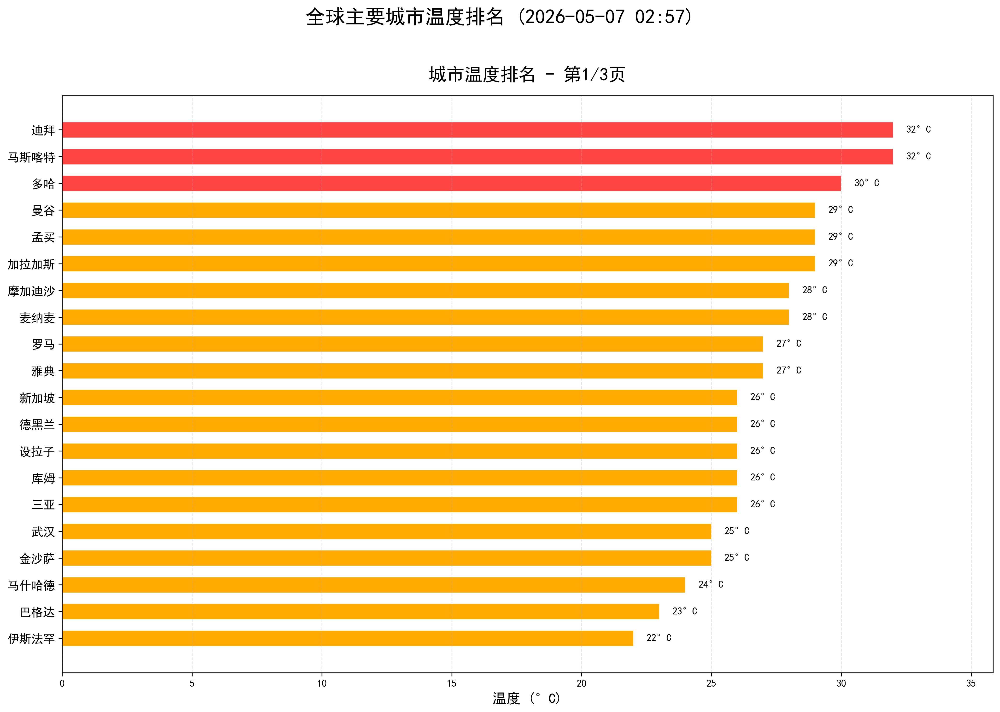
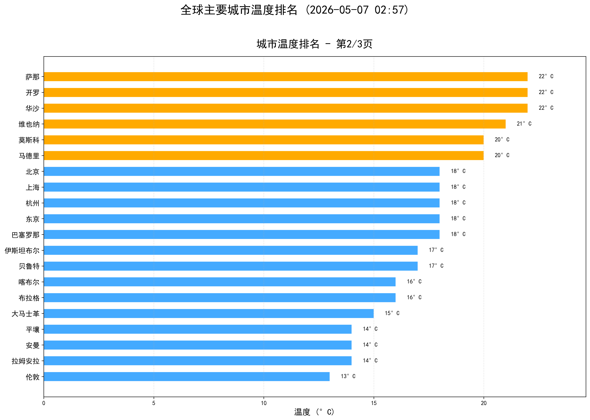
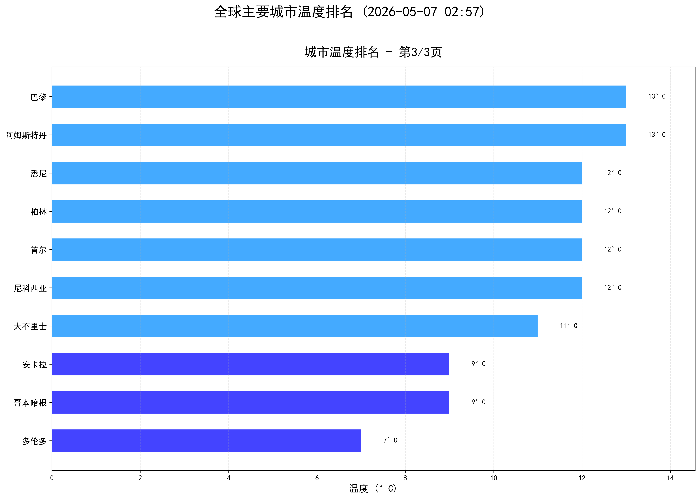
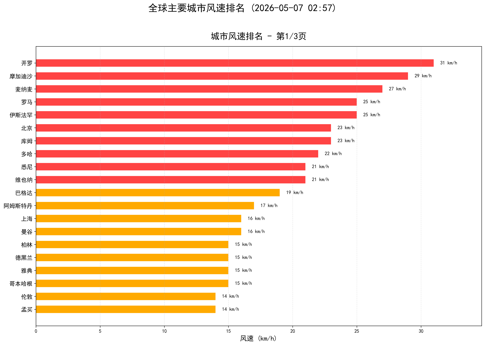
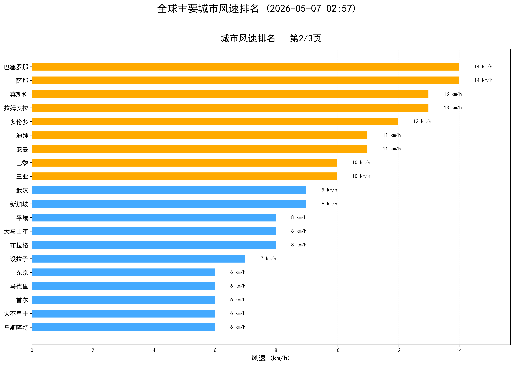
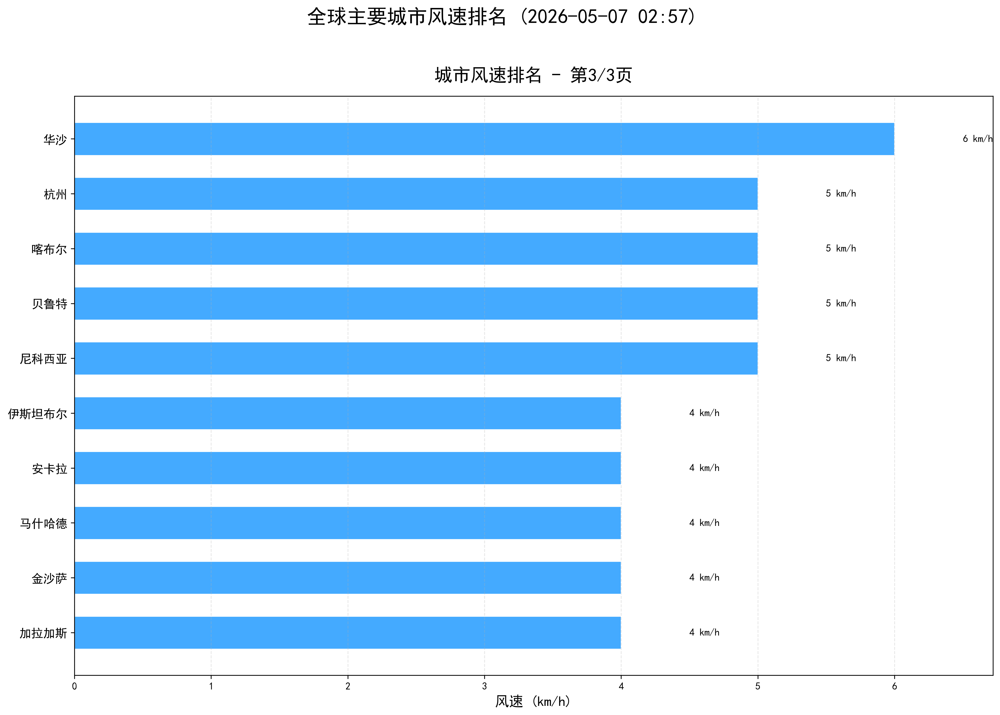

# 全球主要城市天气监测系统
[https://github.com/QuantumEdgeCode/staing/edit/main/README.md](https://raw.githubusercontent.com/QuantumEdgeCode/staing/refs/heads/main/README.md)
## 📖 项目简介

基于 GitHub Actions 的自动化天气监测系统，每日定时获取全球 **56个主要城市** 的天气数据，生成可视化图表并通过邮件发送。

## 🏙️ 城市列表

共计 **56个城市**，覆盖全球主要国家和地区：

| 编号 | 中文名 | 英文名 | 所属区域 |
|------|--------|--------|----------|
| 1 | 北京 | Beijing | 东亚 |
| 2 | 上海 | Shanghai | 东亚 |
| 3 | 武汉 | Wuhan | 东亚 |
| 4 | 杭州 | Hangzhou | 东亚 |
| 5 | 伦敦 | London | 西欧 |
| 6 | 纽约 | New York | 北美 |
| 7 | 东京 | Tokyo | 东亚 |
| 8 | 巴黎 | Paris | 西欧 |
| 9 | 莫斯科 | Moscow | 东欧 |
| 10 | 悉尼 | Sydney | 大洋洲 |
| 11 | 柏林 | Berlin | 中欧 |
| 12 | 罗马 | Rome | 南欧 |
| 13 | 马德里 | Madrid | 南欧 |
| 14 | 首尔 | Seoul | 东亚 |
| 15 | 曼谷 | Bangkok | 东南亚 |
| 16 | 新加坡 | Singapore | 东南亚 |
| 17 | 迪拜 | Dubai | 中东 |
| 18 | 孟买 | Mumbai | 南亚 |
| 19 | 伊斯坦布尔 | Istanbul | 西亚 |
| 20 | 多伦多 | Toronto | 北美 |
| 21 | 巴塞罗那 | Barcelona | 南欧 |
| 22 | 安卡拉 | Ankara | 西亚 |
| 23 | 德黑兰 | Tehran | 中东 |
| 24 | 马什哈德 | Mashhad | 中东 |
| 25 | 伊斯法罕 | Isfahan | 中东 |
| 26 | 设拉子 | Shiraz | 中东 |
| 27 | 大不里士 | Tabriz | 中东 |
| 28 | 库姆 | Qom | 中东 |
| 29 | 平壤 | Pyongyang | 东亚 |
| 30 | 喀布尔 | Kabul | 中亚/南亚 |
| 31 | 摩加迪沙 | Mogadishu | 东非 |
| 32 | 萨那 | Sanaa | 中东 |
| 33 | 阿姆斯特丹 | Amsterdam | 西欧 |
| 34 | 雅典 | Athens | 南欧 |
| 35 | 金沙萨 | Kinshasa | 中非 |
| 36 | 加拉加斯 | Caracas | 南美 |
| 37 | 阿布扎比 | Abu Dhabi | 中东 |
| 38 | 三亚 | Sanya | 东亚 |
| 39 | 香港 | Hong Kong | 东亚 |
| 40 | 新德里 | New Delhi | 南亚 |
| 41 | 巴格达 | Baghdad | 中东 |
| 42 | 科威特城 | Kuwait City | 中东 |
| 43 | 多哈 | Doha | 中东 |
| 44 | 麦纳麦 | Manama | 中东 |
| 45 | 马斯喀特 | Muscat | 中东 |
| 46 | 安曼 | Amman | 中东 |
| 47 | 贝鲁特 | Beirut | 中东 |
| 48 | 大马士革 | Damascus | 中东 |
| 49 | 特拉维夫 | Tel Aviv | 中东 |
| 50 | 拉姆安拉 | Ramallah | 中东 |
| 51 | 尼科西亚 | Nicosia | 地中海 |
| 52 | 开罗 | Cairo | 北非 |
| 53 | 维也纳 | Vienna | 中欧 |
| 54 | 布拉格 | Prague | 中欧 |
| 55 | 哥本哈根 | Copenhagen | 北欧 |
| 56 | 华沙 | Warsaw | 东欧 |

## 🚀 功能特性

- **自动获取**：通过 wttr.in API 获取实时天气数据
- **定时执行**：每天北京时间 05:00 自动运行
- **数据清洗**：自动解析温度、风速、天气图标
- **可视化图表**：
  - 总览图（温度 + 风速）
  - 温度排名分页（每页20个城市）
  - 风速排名分页（每页20个城市）
- **邮件推送**：结果以邮件附件形式发送
- **缺失标记**：自动识别并列出数据缺失的城市

## 📁 项目结构

```
.
├── .github/workflows/action.yml # GitHub Actions 工作流
├── weather.sh                   # 天气数据获取脚本
├── weather_plot.py              # 可视化图表生成
├── result.txt                   # 原始天气数据
└── README.md                    # 项目文档
```

## ⚙️ 配置说明

### GitHub Secrets

| Secret | 说明 |
|--------|------|
| `MAIL_USERNAME` | Gmail 邮箱地址 |
| `MAIL_PASSWORD` | Gmail 应用专用密码 |
| `MAIL_TO` | 接收邮件的邮箱地址 |

### 执行时间

```text
cron: '0 21 * * *' # UTC 21:00 = 北京时间 05:00（凌晨5点）
```

## 🔌 数据获取

通过 wttr.in API 逐城市请求天气数据，每次请求格式如下：

### 请求地址

```text
wttr.in/${CITY}?format=4&m
```

| 参数 | 说明 |
|------|------|
| `${CITY}` | 城市英文名（如 Beijing、London） |
| `format=4` | 紧凑单行输出格式（温度、天气图标、风速风向） |
| `m` | 公制单位（摄氏度、km/h） |

### 请求头

使用现代浏览器 User-Agent 避免被限流：

```bash
UA="Mozilla/5.0 (Windows NT 10.0; Win64; x64) AppleWebKit/537.36 (KHTML, like Gecko) Chrome/114.0.0.0 Safari/537.36"
```

### 返回数据示例

```text
北京 Beijing ☀️ 🌡️+18°C 🌬️↓23km/h
上海 Shanghai 🌤️ 🌡️+18°C 🌬️↖16km/h
武汉 Wuhan 🌦️ 🌡️+25°C 🌬️←9km/h
```
上海 Shanghai 🌤️ 🌡️+18°C 🌬️↖16km/h
武汉 Wuhan 🌦️ 🌡️+25°C 🌬️←9km/h
...


### 图表输出

#### 🌡️ 天气总览图



#### 🔥 温度排名

| 第1页 | 第2页 | 第3页 |
|:---:|:---:|:---:|
|  |  |  |

#### 🌬️ 风速排名

| 第1页 | 第2页 | 第3页 |
|:---:|:---:|:---:|
|  |  |  |

## 📧 邮件格式

```text
北京 Beijing ☀️ 🌡️+18°C 🌬️↓23km/h
上海 Shanghai 🌤️ 🌡️+18°C 🌬️↖16km/h
...

📊 统计汇总:
数据来源: result.txt
总城市数: 56
有效数据: 50
数据缺失: 6 (纽约, 阿布扎比, 香港, 新德里, 科威特城, 特拉维夫)
当前时间: 2026-05-07 21:00

📎 附件说明:
weather_overview_2026-05-07.png
weather_temp_page*_2026-05-07.png
weather_wind_page*_2026-05-07.png
```

## 🛠️ 技术栈

- **Shell**：数据获取与清洗
- **Python**：Matplotlib 可视化
- **GitHub Actions**：自动化调度
- **wttr.in**：天气数据源

## 📝 更新日志

- 2026-05-07：覆盖56个全球主要城市
- 支持中文图表显示（文泉驿字体）
- 自动跳过缺失数据城市
- 邮件附件包含 PNG 图表
